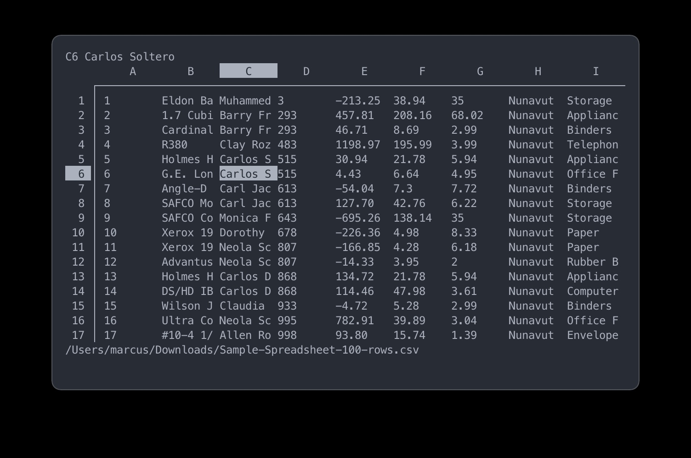

# shit

`shit` (**Sh**eets **I**n **T**erminal) is a simple csv / xlsx reader
you can use from the comforts of your terminal.

> This is still a work in progress. There will be no official releases
> until I deem it as ready. Use it at your own discretion.

## Screenshot



## Installation

I have plans of making `shit` available on Homebrew, as well as
publishing pre-compiled binaries for easier installation. However, for
now, please make sure you have `go` on your system before installing
`shit`.

```
go get github.com/chunkhang/shit
```

## Building

See [BUILD.md](./BUILD.md).

## Usage

```
shit [filename]
```

## FAQ

### How do I pronounce `shit`?

Pronounce `shit` like how you pronounce "sheet".

### Do I need `shit`?

Maybe you just prefer reading csv / xlsx files from the terminal. Or
perhaps like me, your license for Microsoft Excel expired, and you still
miss it sometimes.

## Inspirations

- [scim](https://github.com/andmarti1424/sc-im)
- [wk](https://github.com/SheetJS/wk)
- [x_x](https://github.com/kristianperkins/x_x)
